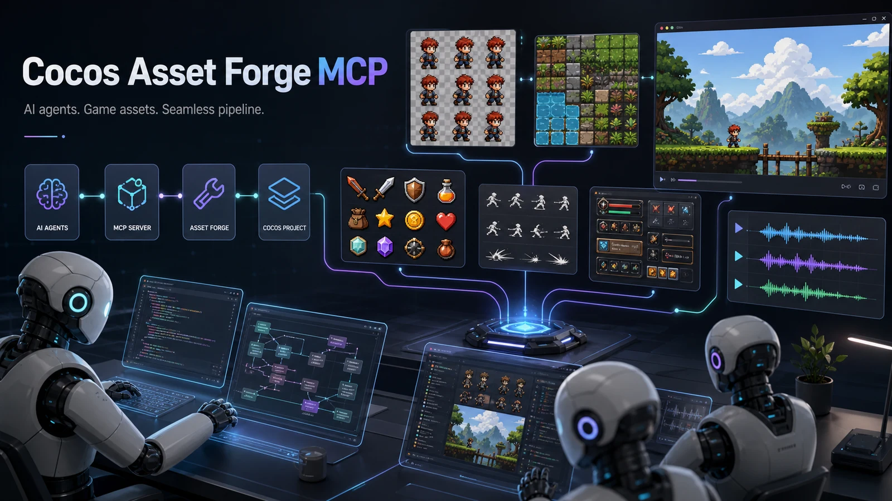

# Cocos Asset Forge MCP

English | [简体中文](./README.zh-CN.md)



[](https://nodejs.org/)
[](https://www.typescriptlang.org/)
[](https://modelcontextprotocol.io/)
[](./LICENSE)

An MCP server for AI-assisted Cocos Creator asset production. Coding agents such as Claude, Codex, Qoder, Trae, Cursor, and other MCP clients can call high-level tools to generate sprites, animation frames, tilesets, UI assets, sound effects, and music, then receive Cocos-ready files instead of raw model output.

## Quick Links

- [Install](#install)
- [MCP client config](#mcp-client-config)
- [Companion Codex skill](#companion-codex-skill)
- [LLM install prompt](./docs/installation.md#llm-install-prompt)
- [Uninstall](#uninstall)
- [Generation strategy](#generation-strategy)

## Highlights

- Cocos-ready output: real RGBA transparent PNGs, alpha-bounds trimming with safe padding, frame manifests, `.plist` atlas metadata, and AudioClip-friendly WAV/MP3/OGG files.
- Local cutout pipeline: generated sprites use a flat `#00ff00` chroma-key background by default, then Asset Forge removes the connected background locally instead of trusting fake AI checkerboards.
- Optional local segmentation backend: configure a command such as `rembg` for difficult existing images or automatic fallback when chroma-key removal is not enough.
- Consistency-first animation workflow: generate a 3x3/4x3 contact sheet, slice it into frames, clean alpha, then repack it for Cocos.
- Motion-readability QA: sprite sheet tools compare consecutive frames and warn when the model has produced near-duplicate static poses.
- Provider abstraction: use mock providers offline, fal, Hugging Face, ModelScope, SiliconFlow, OpenAI-compatible endpoints, generic HTTP, or ComfyUI-style workflows.
- Separate model intent for images, SFX, and music so game teams can choose the right model for each asset class.
- MCP-native tool surface for coding agents, with JSON reports that include written files, warnings, Cocos import hints, and next steps.

## Why This Exists

AI asset generation is useful, but raw model output is not a complete game asset pipeline:

- Sprites need real alpha, not a drawn checkerboard, plus trimmed transparent bounds, predictable names, and importable PNG files.
- Animation frames need stable ordering, fixed source frame boxes, packed sheets, and frame coordinate metadata that preserves trimmed-frame offsets.
- Character consistency often benefits from one 3x3/4x3 contact sheet that is sliced into frames, rather than independent per-frame generations.
- Tiles need grid packing and map-editor-friendly metadata.
- Audio needs Cocos-supported formats, sample-rate/channel normalization, and explicit SFX/music-loop intent.
- The calling coding agent should not have to know every model API or every Cocos import detail.

Cocos Creator supports workflows such as SpriteFrame creation from textures, Auto Atlas packing, `.plist` atlas indexes, AudioClip imports, TiledMap resources, and AnimationClip spriteFrame tracks. Asset Forge turns AI output into files and manifests aligned with those workflows.

## Tools

| Tool | Purpose |
| --- | --- |
| `asset_forge_get_config` | Show active config with secrets redacted. |
| `asset_forge_plan_pack` | Produce an actionable asset checklist for a Cocos game. |
| `asset_forge_generate_sprite` | Generate one sprite and adapt it to transparent PNG. |
| `asset_forge_generate_sprite_sheet` | Generate ordered frames, export individual PNGs, pack a sheet, and emit `.plist` plus manifest. |
| `asset_forge_generate_sprite_grid_sheet` | Generate one 3x3/4x3 contact sheet for stronger identity consistency, slice it, clean alpha, and pack frames. |
| `asset_forge_generate_tileset` | Generate tiles and pack a grid tileset. |
| `asset_forge_generate_ui_pack` | Generate buttons, panels, icons, meters, and other UI sprites. |
| `asset_forge_generate_sfx` | Generate/transcode a short Cocos AudioClip. |
| `asset_forge_generate_music_loop` | Generate/transcode loop-oriented background music. |
| `asset_forge_adapt_image` | Convert an existing image into a Cocos-ready PNG. |
| `asset_forge_adapt_audio` | Convert an existing audio file into a Cocos-ready AudioClip file. |

## Companion Codex Skill

This repository includes a companion Codex skill under [`skills/cocos-asset-pipeline-director`](./skills/cocos-asset-pipeline-director). The MCP provides the executable asset tools; the skill teaches an agent how to plan Cocos-ready asset packs, choose the right tool, write stable prompts, preserve generated metadata, and verify outputs before import.

To install it for Codex:

```bash
mkdir -p ~/.codex/skills
cp -R skills/cocos-asset-pipeline-director ~/.codex/skills/
```

Use the skill together with an MCP client entry that exposes this server as `cocos_asset_forge`.

## Install

```bash
npm install
npm run build
```

Run locally during development:

```bash
npm run dev
```

Use the built server:

```bash
node dist/index.js --config ./examples/config.example.json
```

Full install instructions, Codex config, LLM install prompts, and uninstall prompts are available in [docs/installation.md](./docs/installation.md).

Provider keys can live directly in the MCP server config through `apiKey`, or in `.env.local`/environment variables through `apiKeyEnv`. Inline config is convenient for local MCP client setups, but do not commit real keys.

```json
{
  "imageProvider": {
    "kind": "fal-image",
    "name": "fal-flux-2-pro",
    "apiKey": "your-fal-key",
    "model": "fal-ai/flux-2-pro"
  }
}
```

You can also pass config inline from an MCP client:

```json
{
  "mcpServers": {
    "cocos-asset-forge": {
      "command": "node",
      "args": [
        "/absolute/path/to/cocos-asset-forge-mcp/dist/index.js",
        "--config-json",
        "{\"imageProvider\":{\"kind\":\"fal-image\",\"name\":\"fal-flux-2-pro\",\"apiKey\":\"your-fal-key\",\"model\":\"fal-ai/flux-2-pro\"}}"
      ]
    }
  }
}
```

## MCP Client Config

Example for MCP clients that launch stdio servers:

```json
{
  "mcpServers": {
    "cocos-asset-forge": {
      "command": "node",
      "args": [
        "/absolute/path/to/cocos-asset-forge-mcp/dist/index.js",
        "--config",
        "/absolute/path/to/cocos-asset-forge-mcp/examples/config.fal.example.json"
      ]
    }
  }
}
```

If you prefer to let a coding agent install it for you, use the [LLM install prompt](./docs/installation.md#llm-install-prompt).

## Uninstall

Remove the `cocos-asset-forge` or `cocos_asset_forge` entry from your MCP client config, then restart the client. Do not delete generated assets unless you no longer need them.

For a safe step-by-step uninstall and an LLM-ready uninstall prompt, see [docs/installation.md](./docs/installation.md#llm-uninstall-prompt).

## Provider Configuration

The default provider is `mock`, so the pipeline works offline without external API keys. Real projects should configure image/audio providers in JSON.

Secret lookup priority is `apiKey` first, then `apiKeyEnv`, then provider-specific default environment variables such as `FAL_KEY`, `FAL_API_KEY`, `HF_TOKEN`, or `HUGGINGFACE_API_KEY`. `asset_forge_get_config` redacts inline keys before returning config to the calling agent.

```json
{
  "defaultOutputDir": "./generated/cocos-assets",
  "imageProvider": {
    "kind": "openai-compatible-image",
    "name": "my-image-provider",
    "baseUrl": "https://api.example.com",
    "apiKey": "replace-with-your-key",
    "model": "image-model-name"
  },
  "audioProvider": {
    "kind": "generic-http-audio",
    "name": "my-audio-provider",
    "baseUrl": "https://api.example.com/v1/audio/generate",
    "apiKey": "replace-with-your-key",
    "model": "audio-model-name",
    "responsePath": "data.0.b64_audio"
  }
}
```

Supported provider kinds:

- `mock`: deterministic offline PNG/WAV generation for tests and demos.
- `openai-compatible-image`: POSTs to `/v1/images/generations` and expects `b64_json` or `url`.
- `generic-http-image`: generic HTTP image provider.
- `generic-http-audio`: generic HTTP audio provider.
- `fal-image`: uses `@fal-ai/client`, reads `apiKey`, `apiKeyEnv`, `FAL_KEY`, or `FAL_API_KEY`, and defaults to `fal-ai/flux-2-pro`.
- `fal-audio`: uses `@fal-ai/client` and defaults to Stable Audio 3 Small SFX or Music based on tool intent.
- `huggingface-image`: calls the Hugging Face Inference text-to-image API and defaults to `black-forest-labs/FLUX.1-dev`.
- `siliconflow-image`: calls SiliconFlow's OpenAI-compatible image endpoint and defaults to `Kwai-Kolors/Kolors`.
- `modelscope-image`: generic ModelScope-style HTTP image provider for ModelScope deployments or gateways; set `baseUrl`, `model`, and `responsePath` for your endpoint.
- `comfyui`: currently treated as a generic HTTP image endpoint; custom workflow parameters can be supplied through `requestTemplate`.

Provider preset examples:

- [examples/config.fal.example.json](./examples/config.fal.example.json)
- [examples/config.fal-rembg.example.json](./examples/config.fal-rembg.example.json)
- [examples/config.huggingface.example.json](./examples/config.huggingface.example.json)
- [examples/config.siliconflow.example.json](./examples/config.siliconflow.example.json)
- [examples/config.modelscope.example.json](./examples/config.modelscope.example.json)

fal image example:

```json
{
  "imageProvider": {
    "kind": "fal-image",
    "name": "fal-flux-2-pro",
    "apiKeyEnv": "FAL_KEY",
    "model": "fal-ai/flux-2-pro"
  }
}
```

fal audio example:

```json
{
  "sfxProvider": {
    "kind": "fal-audio",
    "name": "fal-stable-audio-3-small-sfx",
    "apiKeyEnv": "FAL_KEY",
    "model": "fal-ai/stable-audio-3/small/sfx/text-to-audio"
  },
  "musicProvider": {
    "kind": "fal-audio",
    "name": "fal-stable-audio-3-small-music",
    "apiKeyEnv": "FAL_KEY",
    "model": "fal-ai/stable-audio-3/small/music/text-to-audio"
  }
}
```

## Generation Strategy

Use `asset_forge_generate_sprite_grid_sheet` for characters, enemies, props with multiple states, and short animation cycles. It asks the image model for one fixed-grid contact sheet, then slices cells left-to-right and top-to-bottom. Because the model sees all poses in one composition, it usually preserves identity, costume, proportions, camera, and palette better than independent frame generation.

The grid prompt includes action-specific pose progressions for common motions such as run, walk, idle, jump, attack, and death. After slicing, Asset Forge compares consecutive frames and reports a low-variation warning if the sheet looks like repeated static artwork. Treat that warning as a failed animation candidate and regenerate with stronger motion language, a better reference sheet, or a model that follows contact-sheet instructions more reliably.

Use `asset_forge_generate_sprite_sheet` only when the provider cannot produce clean contact sheets, or when each frame needs a very different prompt. Use `asset_forge_generate_sprite` for standalone assets and placeholders.

For transparent sprites, Asset Forge defaults to a chroma-key workflow: it asks the model for a flat `#00ff00` background, then removes only the key-colored region connected to the image border. This produces real alpha PNGs and avoids treating AI-drawn checkerboards as transparency.

After alpha cleanup, sprites are trimmed to their visible alpha bounds with a small transparent safety padding by default. For animation sheets, Asset Forge keeps the original frame-box dimensions in the manifest and `.plist` through `sourceSize`, `sourceColorRect`, and `offset`, so Cocos-side animation alignment can survive per-frame trimming instead of re-centering every frame.

When source backgrounds are not controlled, configure `cutout.backend`:

- `auto`: chroma-key first; if too little background is removed and `command` is configured, fall back to local segmentation.
- `chroma-key`: only run the built-in connected chroma-key remover.
- `local-command`: always run a local segmentation command.

Example with Python `rembg` installed on the machine:

```json
{
  "cutout": {
    "backend": "auto",
    "command": "rembg",
    "args": ["i", "{input}", "{output}"],
    "timeoutMs": 300000,
    "triggerMinRemovedRatio": 0.25
  }
}
```

For reference-image workflows, pass `referenceImagePath` or `referenceImageUrl` and configure `imageProvider.model` to an edit/image-to-image capable fal model. Text-to-image models are intentionally rejected when a reference image is supplied, so the calling agent gets a clear failure instead of silently losing consistency.

Recommended fal model presets:

- Fast iteration sprites: `fal-ai/flux/schnell` or a fast FLUX.2 variant.
- Higher quality sprites/contact sheets: `fal-ai/flux-2-pro` or FLUX.2 flex/pro variants.
- Reference-image edits and identity preservation: `fal-ai/qwen-image-2/edit`, `fal-ai/qwen-image-edit-2511`, or `fal-ai/flux-2-pro/edit`.
- Sound effects: `fal-ai/stable-audio-3/small/sfx/text-to-audio`.
- Music loops: `fal-ai/stable-audio-3/small/music/text-to-audio`.
- Future SFX specialization: add a dedicated SFX provider such as CassetteAI when UI/combat sound precision matters more than musicality.

## Output Contract

Every generation tool returns JSON text with:

- `files`: absolute paths written by the server.
- `manifest`: a `.cocos-asset.json` file when metadata is needed.
- `warnings`: quality or import caveats the calling agent should surface.
- `cocos.importPath`: best-effort Cocos project-relative path.
- `cocos.recommendedType`: recommended import type, such as SpriteFrame, SpriteAtlas, AudioClip, or TiledMap texture.
- `cocos.notes`: next steps for the calling agent.

Image postprocessing defaults to `transparentBackground: true`, `trimTransparentEdges: true`, and `trimTransparentPadding: 2`. Turn trimming off for fixed-size tiles, backgrounds, or any asset where the full canvas is itself meaningful.

## Development

```bash
npm run typecheck
npm test
npm run build
```

`ffmpeg` is used for audio transcoding when available. Without it, the server can still copy same-format audio, but format conversion requires `ffmpeg`.

## Roadmap

- Native Cocos editor extension to create `.anim` clips from emitted frame manifests.
- First-class ComfyUI workflow submission and polling.
- Provider packages for Replicate, Fal, Stability, ElevenLabs, Suno-like services, and local models.
- Texture extrusion that duplicates edge pixels instead of transparent padding.
- Tiled `.tsx` generation and optional `.tmx` starter maps.
- Rich visual QA reports for sprite sheet frame consistency and pose progression.

## References

- Cocos Creator Auto Atlas packs image series into sprite sheets, similar to TexturePacker: <https://docs.cocos.com/creator/3.8/manual/en/asset/auto-atlas.html>
- Cocos Creator Atlas assets use a texture plus index files such as `.plist`: <https://docs.cocos.com/creator/3.8/manual/en/asset/atlas.html>
- Cocos Creator imports common audio formats as AudioClip assets: <https://docs.cocos.com/creator/3.8/manual/en/asset/audio.html>
- Cocos Creator TiledMap resources use `.tmx`, `.png`, and sometimes `.tsx`: <https://docs.cocos.com/creator/3.8/manual/en/asset/tiledmap.html>
- SpriteFrame animation tracks use `cc.Sprite.spriteFrame`: <https://docs.cocos.com/creator/3.8/manual/en/animation/edit-animation-clip.html>
- MCP TypeScript SDK exposes tools over standard transports: <https://ts.sdk.modelcontextprotocol.io/>
