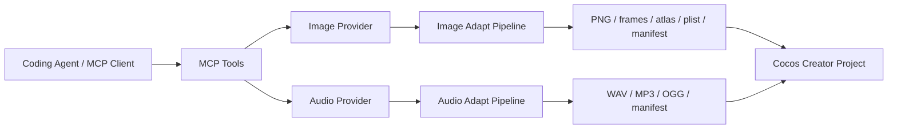

# Architecture

Cocos Asset Forge MCP has two hard boundaries:

1. MCP tools express game-developer intent.
2. Pipelines turn provider output into Cocos-oriented files.

Provider APIs are deliberately isolated so users can choose their own multimodal model stack without changing tool names or client prompts.

## Layers

### MCP Surface

`src/tools/register.ts` registers stable tool names. Tool schemas live in `src/tools/schemas.ts` and use Zod validation, so malformed calls fail before touching provider APIs or the filesystem.

### Provider Layer

`src/generation/types.ts` defines `ImageProvider` and `AudioProvider`. Current implementations:

- `MockImageProvider` and `MockAudioProvider` for offline development.
- `OpenAICompatibleImageProvider` for image APIs with `/v1/images/generations`.
- `GenericHttpImageProvider` and `GenericHttpAudioProvider` for arbitrary HTTP providers.

### Cocos Adaptation Layer

`src/processing/image.ts` handles:

- RGBA PNG normalization.
- Chroma-key/corner-color background removal.
- Fixed-grid contact sheet slicing for 3x3, 4x3, and other sprite consistency workflows.
- Optional transparent-edge trimming.
- Optional power-of-two padding.
- Sprite sheet packing.
- TexturePacker-style `.plist` output.
- `.cocos-asset.json` manifests.

`src/processing/audio.ts` handles:

- Source preservation.
- ffmpeg-based transcoding.
- Sample rate/channel normalization.
- Optional silence trimming and loudness normalization.
- Audio manifests.

## Design Decisions

- The server writes absolute paths so calling agents can modify or import files immediately.
- Cocos `.meta` files are not generated in v0.1 because Creator owns UUID and importer metadata. The safer default is to let Cocos import generated assets, then build editor automation around the manifest.
- Sprite sheets include both packed PNG and individual frames. That gives teams the choice between Cocos Auto Atlas, external atlas tooling, and custom AnimationClip generation.
- Contact-sheet generation is the preferred animation path because one model call usually preserves identity, costume, palette, and camera better than isolated per-frame calls.
- The mock provider is not a toy path; it is the contract test path. New providers should be able to pass the same processing tests.

## Security Notes

- Secrets are referenced by environment variable name and never written to manifests.
- `asset_forge_get_config` redacts whether key env vars are merely set or missing.
- The server refuses to overwrite files unless `safety.overwrite` is enabled.
- Provider responses are treated as untrusted binary input and normalized before use.
